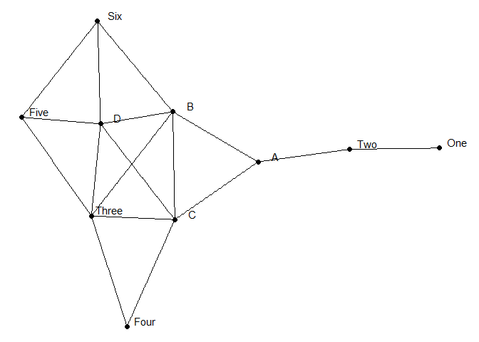
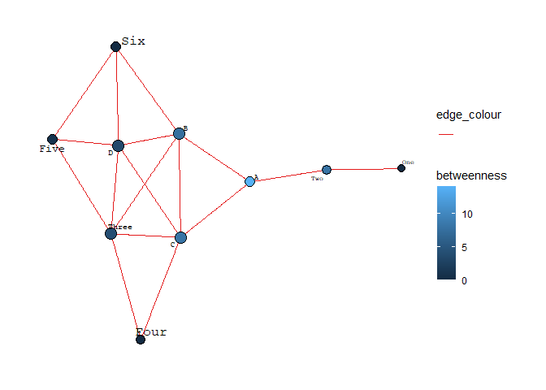

Exercise 2
================

## install igraph

``` r
install.packages("igraph", repos = "http://cran.us.r-project.org")
```

    ## Installing package into 'C:/Users/bapti/AppData/Local/R/win-library/4.2'
    ## (as 'lib' is unspecified)

    ## package 'igraph' successfully unpacked and MD5 sums checked

    ## Warning: cannot remove prior installation of package 'igraph'

    ## Warning in file.copy(savedcopy, lib, recursive = TRUE): problem copying C:
    ## \Users\bapti\AppData\Local\R\win-library\4.2\00LOCK\igraph\libs\x64\igraph.dll
    ## to C:\Users\bapti\AppData\Local\R\win-library\4.2\igraph\libs\x64\igraph.dll:
    ## Permission denied

    ## Warning: restored 'igraph'

    ## 
    ## The downloaded binary packages are in
    ##  C:\Users\bapti\AppData\Local\Temp\RtmpO0wYn9\downloaded_packages

``` r
library(igraph)
```

    ## 
    ## Attaching package: 'igraph'

    ## The following objects are masked from 'package:stats':
    ## 
    ##     decompose, spectrum

    ## The following object is masked from 'package:base':
    ## 
    ##     union

## Load libraries

``` r
library(tidyverse)
```

    ## ── Attaching packages ─────────────────────────────────────── tidyverse 1.3.1 ──

    ## ✔ ggplot2 3.3.5     ✔ purrr   0.3.4
    ## ✔ tibble  3.1.6     ✔ dplyr   1.0.9
    ## ✔ tidyr   1.2.0     ✔ stringr 1.4.0
    ## ✔ readr   2.1.2     ✔ forcats 0.5.1

    ## ── Conflicts ────────────────────────────────────────── tidyverse_conflicts() ──
    ## ✖ dplyr::as_data_frame() masks tibble::as_data_frame(), igraph::as_data_frame()
    ## ✖ purrr::compose()       masks igraph::compose()
    ## ✖ tidyr::crossing()      masks igraph::crossing()
    ## ✖ dplyr::filter()        masks stats::filter()
    ## ✖ dplyr::groups()        masks igraph::groups()
    ## ✖ dplyr::lag()           masks stats::lag()
    ## ✖ purrr::simplify()      masks igraph::simplify()

``` r
library(tidygraph)
```

    ## 
    ## Attaching package: 'tidygraph'

    ## The following object is masked from 'package:igraph':
    ## 
    ##     groups

    ## The following object is masked from 'package:stats':
    ## 
    ##     filter

``` r
library(ggraph)
library(readr)
```

## Load nodes table

``` r
nodes <- read_csv("Ex2 - NODES.csv")
```

    ## Rows: 10 Columns: 1
    ## ── Column specification ────────────────────────────────────────────────────────
    ## Delimiter: ","
    ## chr (1): NAME
    ## 
    ## ℹ Use `spec()` to retrieve the full column specification for this data.
    ## ℹ Specify the column types or set `show_col_types = FALSE` to quiet this message.

``` r
head(nodes)
```

    ## # A tibble: 6 × 1
    ##   NAME 
    ##   <chr>
    ## 1 A    
    ## 2 B    
    ## 3 C    
    ## 4 D    
    ## 5 One  
    ## 6 Two

## Load edges table

``` r
edges <- read_csv("Ex2 - EDGES.csv")
```

    ## Rows: 17 Columns: 2
    ## ── Column specification ────────────────────────────────────────────────────────
    ## Delimiter: ","
    ## chr (2): Source, Target
    ## 
    ## ℹ Use `spec()` to retrieve the full column specification for this data.
    ## ℹ Specify the column types or set `show_col_types = FALSE` to quiet this message.

``` r
head(edges)
```

    ## # A tibble: 6 × 2
    ##   Source Target
    ##   <chr>  <chr> 
    ## 1 One    Two   
    ## 2 Two    A     
    ## 3 A      B     
    ## 4 A      C     
    ## 5 B      C     
    ## 6 B      Three

## Plot network

Create object that ggraph could work with

``` r
ig <- igraph::graph_from_data_frame(edges, vertices = nodes) %>% as_tbl_graph()
```

Create and display plot with lables

``` r
social_net <- ggraph(ig, layout = "stress") +                                                                                                         
  geom_node_point(size = 2) +                                         
  geom_node_text(aes(label = name), nudge_y = 0.05, nudge_x = 0.2)+ 
  geom_edge_link() +
  theme_void()

show(social_net)
```

<!-- -->

From this plot, degree centrality puts B, C, D and 3 as most central
nodes. However A seems to be node with highest betweenness centrality

## Determine measures of centrality

1- fonction 2- resultat (table) 3- plot with degree centrality 4 -
interpretation

for each of the 3 measures of centrality

Than final discussion

-   Degree centrality:

“The simplest measure of centrality is degree centrality. It counts how
many edges each node has - the most degree central actor is the one with
the most ties.”
(<https://bookdown.org/markhoff/social_network_analysis/centrality.html>)

``` r
degree <- degree(ig)
degree
```

    ##     A     B     C     D   One   Two Three  Four  Five   Six 
    ##     3     5     5     5     1     2     5     2     3     3

This table confirms the same level of degree centrality for B, C, D and
Three. This is not very helfpul if we are to pick one seat in the bus,
B, C and D would have the same interest for creating informal social
connexions. Only A can be eliminated. We would need further attributes
to distinguish the advantages of B, C, and D so as to pick one seat to
sit, or look at different centrality measure.

-   Closeness: We measure the distance between two nodes as the length
    of the shortest path between them. Farness, for a given node, is the
    average distance from that node to all other nodes. Closeness is
    then the reciprocal of farness (1/farness).

``` r
closeness <- closeness(ig)
closeness
```

    ##          A          B          C          D        One        Two      Three 
    ## 0.07692308 0.12500000 0.14285714 0.20000000 0.03333333 0.04761905 0.25000000 
    ##       Four       Five        Six 
    ##        NaN 1.00000000        NaN

I do not understand why R would not acheive to find a value for the
closeness measure for Four and Six

-   Betweenness centrality

betweenness effectively counts how many shortest paths each node is on.
The higher a node’s betweenness, the more important they are for the
efficient flow of goods in a network.

``` r
betweenness <- betweenness(ig)
betweenness
```

    ##     A     B     C     D   One   Two Three  Four  Five   Six 
    ##  14.0   7.5   8.0   3.5   0.0   8.0   4.0   0.0   1.0   0.0

From betweenness centrality, we find that A is the best choice to pick a
sit because it is the node that concentrates the flow of information in
the network. This appears in the plot of the network we did earlier.

Overall, degree centrality and betweenness give different indications on
which seat to pick. We would need to calculate other measures for
centrality, maybe with directionnal edges, or at least have more
information about each node (attributes of the node).

## Plot with centrality degree

(using code of classmate for the plot here)

``` r
library(graphlayouts)

ggraph(ig, "stress", bbox = 15) +
  geom_edge_link2(aes(edge_colour = ""), edge_width = 0.5) +
  geom_node_point(aes(fill = betweenness, size = degree), shape = 21) +
  geom_node_text(aes(label = name, size=closeness),
    family = "mono", repel = TRUE
  ) +
  scale_edge_colour_brewer(palette = "Set1") +
  scale_size(range = c(2, 5), guide = "none") +
  theme_graph() 
```

    ## Warning in grid.Call(C_stringMetric, as.graphicsAnnot(x$label)): font family not
    ## found in Windows font database

    ## Warning in grid.Call(C_stringMetric, as.graphicsAnnot(x$label)): font family not
    ## found in Windows font database

    ## Warning in grid.Call(C_textBounds, as.graphicsAnnot(x$label), x$x, x$y, : font
    ## family not found in Windows font database

    ## Warning in grid.Call(C_textBounds, as.graphicsAnnot(x$label), x$x, x$y, : font
    ## family not found in Windows font database

    ## Warning in grid.Call(C_textBounds, as.graphicsAnnot(x$label), x$x, x$y, : font
    ## family not found in Windows font database

    ## Warning in grid.Call(C_textBounds, as.graphicsAnnot(x$label), x$x, x$y, : font
    ## family not found in Windows font database

    ## Warning in grid.Call(C_textBounds, as.graphicsAnnot(x$label), x$x, x$y, : font
    ## family not found in Windows font database

<!-- -->
