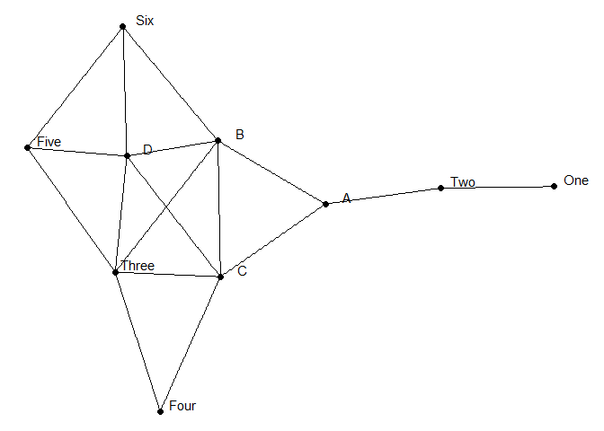

Exercise 2
================

## Load libraries

``` r
library(tidyverse)
```

    ## ── Attaching packages ─────────────────────────────────────── tidyverse 1.3.1 ──

    ## ✔ ggplot2 3.3.5     ✔ purrr   0.3.4
    ## ✔ tibble  3.1.6     ✔ dplyr   1.0.9
    ## ✔ tidyr   1.2.0     ✔ stringr 1.4.0
    ## ✔ readr   2.1.2     ✔ forcats 0.5.1

    ## ── Conflicts ────────────────────────────────────────── tidyverse_conflicts() ──
    ## ✖ dplyr::filter() masks stats::filter()
    ## ✖ dplyr::lag()    masks stats::lag()

``` r
library(tidygraph)
```

    ## 
    ## Attaching package: 'tidygraph'

    ## The following object is masked from 'package:stats':
    ## 
    ##     filter

``` r
library(ggraph)
library(readr)
```

## Load nodes table

``` r
nodes <- read_csv("Ex2 - NODES.csv")
```

    ## Rows: 10 Columns: 1
    ## ── Column specification ────────────────────────────────────────────────────────
    ## Delimiter: ","
    ## chr (1): NAME
    ## 
    ## ℹ Use `spec()` to retrieve the full column specification for this data.
    ## ℹ Specify the column types or set `show_col_types = FALSE` to quiet this message.

``` r
head(nodes)
```

    ## # A tibble: 6 × 1
    ##   NAME 
    ##   <chr>
    ## 1 A    
    ## 2 B    
    ## 3 C    
    ## 4 D    
    ## 5 One  
    ## 6 Two

## Load edges table

``` r
edges <- read_csv("Ex2 - EDGES.csv")
```

    ## Rows: 17 Columns: 2
    ## ── Column specification ────────────────────────────────────────────────────────
    ## Delimiter: ","
    ## chr (2): Source, Target
    ## 
    ## ℹ Use `spec()` to retrieve the full column specification for this data.
    ## ℹ Specify the column types or set `show_col_types = FALSE` to quiet this message.

``` r
head(edges)
```

    ## # A tibble: 6 × 2
    ##   Source Target
    ##   <chr>  <chr> 
    ## 1 One    Two   
    ## 2 Two    A     
    ## 3 A      B     
    ## 4 A      C     
    ## 5 B      C     
    ## 6 B      Three

## Plot network

``` r
ig <- igraph::graph_from_data_frame(edges, vertices = nodes) %>% as_tbl_graph()
```

``` r
social_net <- ggraph(ig, layout = "stress") +                                                                                                         
  geom_node_point(size = 2) +                                         
  geom_node_text(aes(label = name), nudge_y = 0.05, nudge_x = 0.2)+ 
  geom_edge_link() +
  theme_void()

show(social_net)
```

<!-- -->
