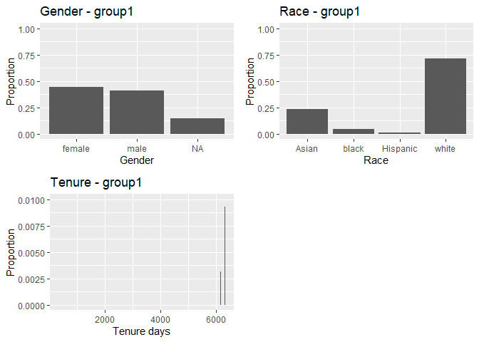
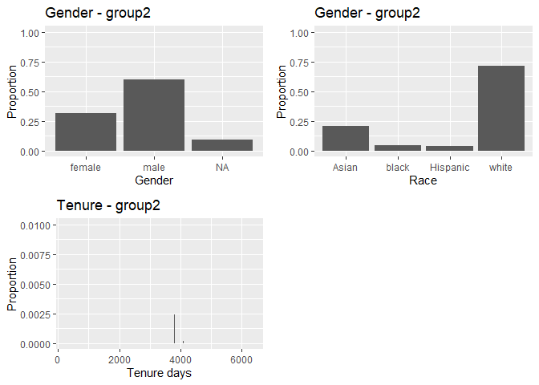
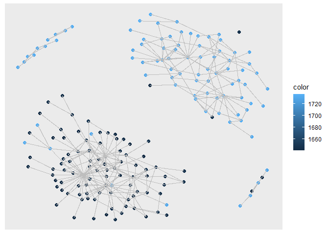
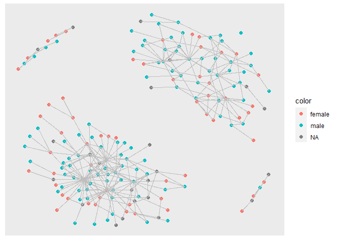
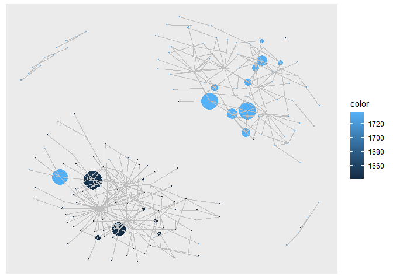
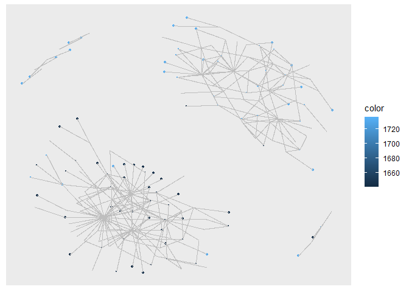

Exercise 3
================

## Install packages

to read parquet file + race + gender

## Load libraries

``` r
library(tidyverse)
```

    ## ── Attaching packages ─────────────────────────────────────── tidyverse 1.3.1 ──

    ## ✔ ggplot2 3.3.5     ✔ purrr   0.3.4
    ## ✔ tibble  3.1.6     ✔ dplyr   1.0.9
    ## ✔ tidyr   1.2.0     ✔ stringr 1.4.0
    ## ✔ readr   2.1.2     ✔ forcats 0.5.1

    ## ── Conflicts ────────────────────────────────────────── tidyverse_conflicts() ──
    ## ✖ dplyr::filter() masks stats::filter()
    ## ✖ dplyr::lag()    masks stats::lag()

``` r
library(igraph)
```

    ## 
    ## Attaching package: 'igraph'

    ## The following objects are masked from 'package:dplyr':
    ## 
    ##     as_data_frame, groups, union

    ## The following objects are masked from 'package:purrr':
    ## 
    ##     compose, simplify

    ## The following object is masked from 'package:tidyr':
    ## 
    ##     crossing

    ## The following object is masked from 'package:tibble':
    ## 
    ##     as_data_frame

    ## The following objects are masked from 'package:stats':
    ## 
    ##     decompose, spectrum

    ## The following object is masked from 'package:base':
    ## 
    ##     union

``` r
library(tidygraph)
```

    ## 
    ## Attaching package: 'tidygraph'

    ## The following object is masked from 'package:igraph':
    ## 
    ##     groups

    ## The following object is masked from 'package:stats':
    ## 
    ##     filter

``` r
library(ggraph)
library(readr)
library(lubridate)
```

    ## 
    ## Attaching package: 'lubridate'

    ## The following objects are masked from 'package:igraph':
    ## 
    ##     %--%, union

    ## The following objects are masked from 'package:base':
    ## 
    ##     date, intersect, setdiff, union

``` r
library(arrow)
```

    ## 
    ## Attaching package: 'arrow'

    ## The following object is masked from 'package:lubridate':
    ## 
    ##     duration

    ## The following object is masked from 'package:utils':
    ## 
    ##     timestamp

``` r
library(gender)
library(wru)
library(ggplot2)
library(gridExtra)
```

    ## 
    ## Attaching package: 'gridExtra'

    ## The following object is masked from 'package:dplyr':
    ## 
    ##     combine

``` r
library(grid)
```

## Load data

``` r
applications <- read_parquet(paste0("app_data_sample.parquet"))
edges <- read_csv("edges_sample.csv")
```

    ## Rows: 32906 Columns: 4
    ## ── Column specification ────────────────────────────────────────────────────────
    ## Delimiter: ","
    ## dbl  (3): application_number, ego_examiner_id, alter_examiner_id
    ## date (1): advice_date
    ## 
    ## ℹ Use `spec()` to retrieve the full column specification for this data.
    ## ℹ Specify the column types or set `show_col_types = FALSE` to quiet this message.

``` r
head(edges)
```

    ## # A tibble: 6 × 4
    ##   application_number advice_date ego_examiner_id alter_examiner_id
    ##                <dbl> <date>                <dbl>             <dbl>
    ## 1            9402488 2008-11-17            84356             66266
    ## 2            9402488 2008-11-17            84356             63519
    ## 3            9402488 2008-11-17            84356             98531
    ## 4            9445135 2008-08-21            92953             71313
    ## 5            9445135 2008-08-21            92953             93865
    ## 6            9445135 2008-08-21            92953             91818

``` r
head(applications)
```

    ## # A tibble: 6 × 16
    ##   application_number filing_date examiner_name_last examiner_name_first
    ##   <chr>              <date>      <chr>              <chr>              
    ## 1 08284457           2000-01-26  HOWARD             JACQUELINE         
    ## 2 08413193           2000-10-11  YILDIRIM           BEKIR              
    ## 3 08531853           2000-05-17  HAMILTON           CYNTHIA            
    ## 4 08637752           2001-07-20  MOSHER             MARY               
    ## 5 08682726           2000-04-10  BARR               MICHAEL            
    ## 6 08687412           2000-04-28  GRAY               LINDA              
    ## # … with 12 more variables: examiner_name_middle <chr>, examiner_id <dbl>,
    ## #   examiner_art_unit <dbl>, uspc_class <chr>, uspc_subclass <chr>,
    ## #   patent_number <chr>, patent_issue_date <date>, abandon_date <date>,
    ## #   disposal_type <chr>, appl_status_code <dbl>, appl_status_date <chr>,
    ## #   tc <dbl>

## Get gender for examiners

get names without repetition:

``` r
examiner_names <- applications %>% 
  distinct(examiner_name_first)
```

Attach a gender and probability to each name and put the results into
the table `examiner_names_gender`

``` r
# get a table of names and gender
examiner_names_gender <- examiner_names %>% 
  do(results = gender(.$examiner_name_first, method = "ssa")) %>% 
  unnest(cols = c(results), keep_empty = TRUE) %>% 
  select(
    examiner_name_first = name,
    gender,
    proportion_female
  )
```

``` r
# remove extra colums from the gender table
examiner_names_gender <- examiner_names_gender %>% 
  select(examiner_name_first, gender)
# joining gender back to the dataset
applications <- applications %>% 
  left_join(examiner_names_gender, by = "examiner_name_first")
# cleaning up
rm(examiner_names)
rm(examiner_names_gender)
gc()
```

    ##            used  (Mb) gc trigger  (Mb) max used (Mb)
    ## Ncells  4790157 255.9    8526330 455.4  5110551  273
    ## Vcells 50018289 381.7   93302478 711.9 80334080  613

## Add race

``` r
examiner_surnames <- applications %>% 
  select(surname = examiner_name_last) %>% 
  distinct()
```

``` r
examiner_race <- predict_race(voter.file = examiner_surnames, surname.only = T) %>% 
  as_tibble()
```

    ## [1] "Proceeding with surname-only predictions..."

    ## Warning in merge_surnames(voter.file): Probabilities were imputed for 698
    ## surnames that could not be matched to Census list.

Pick the race category that has the highest probability for each last
name and then join the table back to the main applications table.

``` r
examiner_race <- examiner_race %>% 
  mutate(max_race_p = pmax(pred.asi, pred.bla, pred.his, pred.oth, pred.whi)) %>% 
  mutate(race = case_when(
    max_race_p == pred.asi ~ "Asian",
    max_race_p == pred.bla ~ "black",
    max_race_p == pred.his ~ "Hispanic",
    max_race_p == pred.oth ~ "other",
    max_race_p == pred.whi ~ "white",
    TRUE ~ NA_character_
  ))
```

Join the data back to the applications table.

``` r
# removing extra columns
examiner_race <- examiner_race %>% 
  select(surname,race)
applications <- applications %>% 
  left_join(examiner_race, by = c("examiner_name_last" = "surname"))
rm(examiner_race)
rm(examiner_surnames)
gc()
```

    ##            used  (Mb) gc trigger  (Mb) max used  (Mb)
    ## Ncells  5130392 274.0    8526330 455.4  5813020 310.5
    ## Vcells 53705001 409.8   93302478 711.9 92542809 706.1

## Add tenure

``` r
examiner_dates <- applications %>% 
  select(examiner_id, filing_date, appl_status_date) 
```

Make dates format consistent (create new variables `start_date` and
\`end_date’)

``` r
examiner_dates <- examiner_dates %>% 
  mutate(start_date = ymd(filing_date), end_date = as_date(dmy_hms(appl_status_date)))
```

Identify the earliest and the latest date for each examiner and
calculate the difference in days, which is their tenure in the
organization.

``` r
examiner_dates <- examiner_dates %>% 
  group_by(examiner_id) %>% 
  summarise(
    earliest_date = min(start_date, na.rm = TRUE), 
    latest_date = max(end_date, na.rm = TRUE),
    tenure_days = interval(earliest_date, latest_date) %/% days(1)
    ) %>% 
  filter(year(latest_date)<2018)
```

Joining back to the applications data.

``` r
applications <- applications %>% 
  left_join(examiner_dates, by = "examiner_id")
rm(examiner_dates)
gc()
```

    ##            used  (Mb) gc trigger   (Mb)  max used   (Mb)
    ## Ncells  5143894 274.8   15444244  824.9  15444244  824.9
    ## Vcells 66082522 504.2  134531567 1026.4 134314516 1024.8

``` r
head(applications)
```

    ## # A tibble: 6 × 21
    ##   application_number filing_date examiner_name_last examiner_name_first
    ##   <chr>              <date>      <chr>              <chr>              
    ## 1 08284457           2000-01-26  HOWARD             JACQUELINE         
    ## 2 08413193           2000-10-11  YILDIRIM           BEKIR              
    ## 3 08531853           2000-05-17  HAMILTON           CYNTHIA            
    ## 4 08637752           2001-07-20  MOSHER             MARY               
    ## 5 08682726           2000-04-10  BARR               MICHAEL            
    ## 6 08687412           2000-04-28  GRAY               LINDA              
    ## # … with 17 more variables: examiner_name_middle <chr>, examiner_id <dbl>,
    ## #   examiner_art_unit <dbl>, uspc_class <chr>, uspc_subclass <chr>,
    ## #   patent_number <chr>, patent_issue_date <date>, abandon_date <date>,
    ## #   disposal_type <chr>, appl_status_code <dbl>, appl_status_date <chr>,
    ## #   tc <dbl>, gender <chr>, race <chr>, earliest_date <date>,
    ## #   latest_date <date>, tenure_days <dbl>

## Select and display subgroups

I selct subgroups with tenure dates covering 2008, when connections were
made according to our edges_sample.csv

``` r
group1 = applications[substr(applications$examiner_art_unit, 1,3)==164,]
summary(group1)
```

    ##  application_number  filing_date         examiner_name_last examiner_name_first
    ##  Length:93342       Min.   :2000-01-03   Length:93342       Length:93342       
    ##  Class :character   1st Qu.:2004-02-06   Class :character   Class :character   
    ##  Mode  :character   Median :2008-04-16   Mode  :character   Mode  :character   
    ##                     Mean   :2008-05-14                                         
    ##                     3rd Qu.:2012-06-08                                         
    ##                     Max.   :2017-05-26                                         
    ##                                                                                
    ##  examiner_name_middle  examiner_id    examiner_art_unit  uspc_class       
    ##  Length:93342         Min.   :59211   Min.   :1641      Length:93342      
    ##  Class :character     1st Qu.:67775   1st Qu.:1643      Class :character  
    ##  Mode  :character     Median :76749   Median :1645      Mode  :character  
    ##                       Mean   :80061   Mean   :1645                        
    ##                       3rd Qu.:94046   3rd Qu.:1647                        
    ##                       Max.   :99985   Max.   :1649                        
    ##                       NA's   :811                                         
    ##  uspc_subclass      patent_number      patent_issue_date   
    ##  Length:93342       Length:93342       Min.   :2000-09-12  
    ##  Class :character   Class :character   1st Qu.:2008-05-13  
    ##  Mode  :character   Mode  :character   Median :2011-08-16  
    ##                                        Mean   :2011-03-27  
    ##                                        3rd Qu.:2014-06-03  
    ##                                        Max.   :2017-06-20  
    ##                                        NA's   :53514       
    ##   abandon_date        disposal_type      appl_status_code appl_status_date  
    ##  Min.   :2000-03-07   Length:93342       Min.   : 16.0    Length:93342      
    ##  1st Qu.:2006-11-07   Class :character   1st Qu.:150.0    Class :character  
    ##  Median :2009-09-25   Mode  :character   Median :161.0    Mode  :character  
    ##  Mean   :2009-12-05                      Mean   :150.6                      
    ##  3rd Qu.:2013-02-04                      3rd Qu.:161.0                      
    ##  Max.   :2017-06-05                      Max.   :454.0                      
    ##  NA's   :51937                           NA's   :155                        
    ##        tc          gender              race           earliest_date       
    ##  Min.   :1600   Length:93342       Length:93342       Min.   :2000-01-03  
    ##  1st Qu.:1600   Class :character   Class :character   1st Qu.:2000-01-10  
    ##  Median :1600   Mode  :character   Mode  :character   Median :2000-01-26  
    ##  Mean   :1600                                         Mean   :2000-07-26  
    ##  3rd Qu.:1600                                         3rd Qu.:2000-09-22  
    ##  Max.   :1600                                         Max.   :2012-04-03  
    ##                                                       NA's   :1884        
    ##   latest_date          tenure_days  
    ##  Min.   :2001-09-14   Min.   : 314  
    ##  1st Qu.:2017-05-19   1st Qu.:6074  
    ##  Median :2017-05-20   Median :6315  
    ##  Mean   :2017-05-06   Mean   :6128  
    ##  3rd Qu.:2017-05-22   3rd Qu.:6338  
    ##  Max.   :2017-05-23   Max.   :6350  
    ##  NA's   :1884         NA's   :1884

``` r
chart1gender <- ggplot(data=group1, aes(x=gender)) +
  geom_bar(aes(y = (..count..)/sum(..count..)) )  +
  ylab("Proportion")+
  xlab("Gender")+
  ylim(0,1)+
  ggtitle(paste0("Gender - group1"))

chart1race <- ggplot(data=group1, aes(x=race)) +
  geom_bar(aes(y = (..count..)/sum(..count..)) )  +
  ylab("Proportion")+
  xlab("Race")+
  ylim(0,1)+
  ggtitle(paste0("Race - group1"))

chart1tenure <- ggplot(data=group1, aes(x=tenure_days)) +
  geom_bar(aes(y = (..count..)/sum(..count..)) )  +
  ylab("Proportion")+
  xlab("Tenure days")+
  ylim(0,0.01)+
  ggtitle(paste0("Tenure - group1"))
grid.arrange(chart1gender,chart1race,chart1tenure,ncol=2, widths=c(1,1))
```

    ## Warning: Removed 1884 rows containing non-finite values (stat_count).

    ## Warning: Removed 29 rows containing missing values (geom_bar).

<!-- --> Group1 rather
equally distributed between male and female. Large proportion of White,
followed by Asian.

``` r
group2 = applications[substr(applications$examiner_art_unit, 1,3)==173,]
summary(group2)
```

    ##  application_number  filing_date         examiner_name_last examiner_name_first
    ##  Length:64804       Min.   :2000-01-03   Length:64804       Length:64804       
    ##  Class :character   1st Qu.:2004-06-16   Class :character   Class :character   
    ##  Mode  :character   Median :2010-08-04   Mode  :character   Mode  :character   
    ##                     Mean   :2009-07-15                                         
    ##                     3rd Qu.:2013-10-23                                         
    ##                     Max.   :2017-05-25                                         
    ##                                                                                
    ##  examiner_name_middle  examiner_id    examiner_art_unit  uspc_class       
    ##  Length:64804         Min.   :59040   Min.   :1731      Length:64804      
    ##  Class :character     1st Qu.:67428   1st Qu.:1732      Class :character  
    ##  Mode  :character     Median :75681   Median :1733      Mode  :character  
    ##                       Mean   :79334   Mean   :1733                        
    ##                       3rd Qu.:94426   3rd Qu.:1734                        
    ##                       Max.   :99922   Max.   :1736                        
    ##                       NA's   :515                                         
    ##  uspc_subclass      patent_number      patent_issue_date   
    ##  Length:64804       Length:64804       Min.   :2000-10-03  
    ##  Class :character   Class :character   1st Qu.:2006-03-07  
    ##  Mode  :character   Mode  :character   Median :2012-09-25  
    ##                                        Mean   :2011-02-19  
    ##                                        3rd Qu.:2015-02-24  
    ##                                        Max.   :2017-06-20  
    ##                                        NA's   :28163       
    ##   abandon_date        disposal_type      appl_status_code appl_status_date  
    ##  Min.   :2000-07-03   Length:64804       Min.   :  1.0    Length:64804      
    ##  1st Qu.:2006-10-11   Class :character   1st Qu.:150.0    Class :character  
    ##  Median :2012-04-20   Mode  :character   Median :150.0    Mode  :character  
    ##  Mean   :2011-03-07                      Mean   :146.6                      
    ##  3rd Qu.:2014-09-09                      3rd Qu.:161.0                      
    ##  Max.   :2017-06-05                      Max.   :854.0                      
    ##  NA's   :48031                           NA's   :115                        
    ##        tc          gender              race           earliest_date       
    ##  Min.   :1700   Length:64804       Length:64804       Min.   :2000-01-03  
    ##  1st Qu.:1700   Class :character   Class :character   1st Qu.:2000-01-06  
    ##  Median :1700   Mode  :character   Mode  :character   Median :2000-01-21  
    ##  Mean   :1700                                         Mean   :2001-10-12  
    ##  3rd Qu.:1700                                         3rd Qu.:2003-10-09  
    ##  Max.   :1700                                         Max.   :2014-09-26  
    ##                                                       NA's   :922         
    ##   latest_date          tenure_days  
    ##  Min.   :2000-09-14   Min.   : 251  
    ##  1st Qu.:2017-05-19   1st Qu.:4971  
    ##  Median :2017-05-22   Median :6311  
    ##  Mean   :2017-05-09   Mean   :5688  
    ##  3rd Qu.:2017-05-23   3rd Qu.:6344  
    ##  Max.   :2017-07-24   Max.   :6391  
    ##  NA's   :922          NA's   :922

``` r
chart2gender <- ggplot(data=group2, aes(x=gender)) +
  geom_bar(aes(y = (..count..)/sum(..count..)) )  +
  ylab("Proportion")+
  xlab("Gender")+
  ylim(0,1)+
  ggtitle(paste0("Gender - group2"))

chart2race <- ggplot(data=group2, aes(x=race)) +
  geom_bar(aes(y = (..count..)/sum(..count..)) )  +
  ylab("Proportion")+
  xlab("Race")+
  ylim(0,1)+
  ggtitle(paste0("Gender - group2"))

chart2tenure <- ggplot(data=group2, aes(x=tenure_days)) +
  geom_bar(aes(y = (..count..)/sum(..count..)) )  +
  ylab("Proportion")+
  xlab("Tenure days")+
  ylim(0,0.01)+
  ggtitle(paste0("Tenure - group2"))
grid.arrange(chart2gender,chart2race,chart2tenure,ncol=2, widths=c(1,1))
```

    ## Warning: Removed 922 rows containing non-finite values (stat_count).

    ## Warning: Removed 24 rows containing missing values (geom_bar).

<!-- -->

Group2 largely skewed to Male. Same race distribution as Group 1, White
predominant followed by Asian, then Black and Hispanic.

## Create and display advice network

Group1 and Group2 list nodes while the connections are provided in the
edges_sample.csv. The individuals seeking advice are ego_examiner_id
while those providing advice are alter_examiner_id. We use nodes and
edges to create network.

First we make our nodes dataframe with our two working groups

``` r
examiner_aus = distinct(subset(applications, select=c(examiner_art_unit, examiner_id)))
examiner_aus$wg = substr(examiner_aus$examiner_art_unit, 1,3)
examiner_aus = examiner_aus[examiner_aus$wg==164 | examiner_aus$wg==173,]
```

now we merge edges from csv and selected work groups, by the field
“examiner id” both for ego and alter, and we keep only those of our two
working groups

``` r
network = merge(x=edges, y=examiner_aus, by.x="ego_examiner_id", by.y="examiner_id", all.x=TRUE)
network = network %>% rename(ego_art_unit=examiner_art_unit, ego_wg=wg)
network = drop_na(network)

network = merge(x=network, y=examiner_aus, by.x="alter_examiner_id", by.y="examiner_id", all.x=TRUE)
network = network %>% rename(alter_art_unit=examiner_art_unit, alter_wg=wg)
network = drop_na(network)
head(network)
```

    ##   alter_examiner_id ego_examiner_id application_number advice_date ego_art_unit
    ## 1             59196           84867           10625915  2008-04-14         1733
    ## 2             59196           84867           10625886  2008-04-14         1733
    ## 3             59196           84867           10875041  2008-06-24         1733
    ## 4             59211           94046           11445410  2008-08-15         1644
    ## 5             59211           94046           11797834  2008-07-10         1644
    ## 6             59211           94046           10186035  2008-03-14         1644
    ##   ego_wg alter_art_unit alter_wg
    ## 1    173           1732      173
    ## 2    173           1732      173
    ## 3    173           1732      173
    ## 4    164           1644      164
    ## 5    164           1644      164
    ## 6    164           1644      164

``` r
#there are 1990 lines of advice
```

``` r
egoNodes = subset(network, select=c(ego_examiner_id,ego_art_unit, ego_wg)) %>% rename(examiner_id=ego_examiner_id,art_unit=ego_art_unit,wg=ego_wg)
alterNodes = subset(network, select=c(alter_examiner_id,alter_art_unit, alter_wg))%>% rename(examiner_id=alter_examiner_id,art_unit=alter_art_unit,wg=alter_wg)
nodes = rbind(egoNodes, alterNodes)
nodes = distinct(nodes)

#there are 220 nodes but we get error related to duplicates so we get rid of those

nodes = nodes %>% group_by(examiner_id) %>% summarise(examiner_id=first(examiner_id), art_unit=first(art_unit), wg=first(wg))
nodes
```

    ## # A tibble: 180 × 3
    ##    examiner_id art_unit wg   
    ##          <dbl>    <dbl> <chr>
    ##  1       59196     1732 173  
    ##  2       59211     1644 164  
    ##  3       59227     1734 173  
    ##  4       59265     1648 164  
    ##  5       59338     1648 164  
    ##  6       59359     1734 173  
    ##  7       59475     1732 173  
    ##  8       59497     1645 164  
    ##  9       59693     1646 164  
    ## 10       59706     1731 173  
    ## # … with 170 more rows

``` r
#we now have 180 nodes, problem is we might be losing data because of this step (non unique nodes may be because seek advice several times)
```

``` r
network = graph_from_data_frame(d=network, vertices=nodes, directed=TRUE)
network
```

    ## IGRAPH b3e891a DN-- 180 1990 -- 
    ## + attr: name (v/c), art_unit (v/n), wg (v/c), application_number (e/n),
    ## | advice_date (e/n), ego_art_unit (e/n), ego_wg (e/c), alter_art_unit
    ## | (e/n), alter_wg (e/c)
    ## + edges from b3e891a (vertex names):
    ##  [1] 59196->84867 59196->84867 59196->84867 59211->94046 59211->94046
    ##  [6] 59211->94046 59211->94046 59211->94046 59211->94046 59211->94046
    ## [11] 59211->94046 59211->94046 59211->63394 59211->94046 59211->94046
    ## [16] 59211->59211 59211->63394 59211->94046 59211->94046 59211->94046
    ## [21] 59211->63394 59211->94046 59227->98045 59227->71655 59227->71655
    ## [26] 59227->61615 59265->76727 59265->72052 59265->76727 59338->71174
    ## + ... omitted several edges

V(network)art_unit

Display network

``` r
V(network)$color = nodes$art_unit
graphnetwork <- ggraph(network, layout = "kk") +                                         
  geom_node_point(size = 2, aes(color = color) ) +  
  geom_node_text(aes(label = ""), nudge_y = 0.05, nudge_x = 0.2)+ 
  geom_edge_link(edge_color="grey")
graphnetwork
```

<!-- --> Note some
clusters in the advice networks, diconnected from the rest. Groupe 1
seeks advice to group 2 on a regular basis while group 2 only
exceptionnaly looks for advice from group 1.

## Calculate centrality scores

### Degree centrality

``` r
degree <- degree(network,v=V(network))
graphnetwork <- ggraph(network, layout = "kk") +                                         
  geom_node_point(size = degree, aes(color = color) ) +  
  geom_node_text(aes(label = ""), nudge_y = 0.05, nudge_x = 0.2)+ 
  geom_edge_link(edge_color="grey")
graphnetwork
```

<!-- --> degree
centrality reflects the number of edges connected to it

we clearly have winners both in the group 1 and group 2.

Let us find who they are

``` r
degree
```

    ## 59196 59211 59227 59265 59338 59359 59475 59497 59693 59706 59738 59771 59987 
    ##     3    27     4     3    29    20     1     5    14     6    77     1    47 
    ## 60431 60575 60958 61105 61276 61558 61615 61757 62098 62346 62397 62498 63011 
    ##     1     7     1     1    13     3    10    32    67     2    24     7     2 
    ## 63226 63324 63394 63470 63511 63842 63963 64004 64053 64064 64169 64331 64445 
    ##     1     2     3     3    23     1     3     1    86     2    24     1     2 
    ## 64506 64507 64659 64940 65024 65446 65654 65805 65919 66266 66336 66436 67217 
    ##     4     3    38     7   198    48     5     1     2   138     1   106     4 
    ## 67620 67657 67698 67901 68165 68227 68445 68546 68603 68665 68922 68970 69193 
    ##     1     2    54     3     5     1     3     2     6    20    14     6     7 
    ## 69583 69917 70176 70204 70227 70858 71101 71174 71259 71414 71655 71946 72052 
    ##    24    29    11    87     6     4     2    14    36    16     9   171    22 
    ## 72102 72153 72355 72524 72666 72820 72882 72903 73074 73383 73689 73788 74224 
    ##     4     6     2     4    23    34   432     6     1     1     2     3    61 
    ## 74684 75243 75367 75380 75406 75409 75568 75730 75774 76727 76749 76959 77112 
    ##     5     1     1     4     4     8    31    14    17    64    10     3     8 
    ## 77791 77971 78003 78488 79495 79564 81117 81987 82047 83254 83794 84289 84867 
    ##     6     1     1     1    10    48     9     4    12    29    10     1     3 
    ## 84896 85381 85761 85865 85987 86115 87897 89539 90219 90331 90863 90956 91016 
    ##    10    24     2    42    16     6   125   212     3     5    15    84     2 
    ## 91048 92572 92733 92784 93421 93626 93715 93839 93869 93909 94046 94084 94238 
    ##     1     2     2    44    35    19     4   156     8     1    18     1     6 
    ## 94285 95084 95459 95604 95634 95660 95784 95814 96027 96068 96143 96267 96371 
    ##     1     3    23    10     2     6     1     2    25     8    26     6     5 
    ## 96500 96556 96568 96865 96963 97024 97543 97553 97705 97745 97772 97910 98045 
    ##     2     1     9    10    19    10    30     1    13     1    10   167    23 
    ## 98469 98470 98563 98700 98891 98943 99207 99316 99340 99879 99892 
    ##     3     5    98     6     3     1     6    28     2    16     2

the Id 72882 has maximum degree centrality at 432. it is part of group1.

``` r
group1[group1$examiner_id==72882,]
```

    ## # A tibble: 960 × 21
    ##    application_number filing_date examiner_name_last examiner_name_first
    ##    <chr>              <date>      <chr>              <chr>              
    ##  1 09445602           2000-03-23  HELMS              LARRY              
    ##  2 09481175           2000-01-12  HELMS              LARRY              
    ##  3 <NA>               NA          <NA>               <NA>               
    ##  4 <NA>               NA          <NA>               <NA>               
    ##  5 09482630           2000-01-12  HELMS              LARRY              
    ##  6 09485737           2000-02-14  HELMS              LARRY              
    ##  7 09489391           2000-01-21  HELMS              LARRY              
    ##  8 09491894           2000-01-26  HELMS              LARRY              
    ##  9 09493539           2000-01-28  HELMS              LARRY              
    ## 10 09497625           2000-02-03  HELMS              LARRY              
    ## # … with 950 more rows, and 17 more variables: examiner_name_middle <chr>,
    ## #   examiner_id <dbl>, examiner_art_unit <dbl>, uspc_class <chr>,
    ## #   uspc_subclass <chr>, patent_number <chr>, patent_issue_date <date>,
    ## #   abandon_date <date>, disposal_type <chr>, appl_status_code <dbl>,
    ## #   appl_status_date <chr>, tc <dbl>, gender <chr>, race <chr>,
    ## #   earliest_date <date>, latest_date <date>, tenure_days <dbl>

``` r
#Examiner with highest degree centrality is 72882, a white male with 5987 days of tenure (against an average of 6128 in group 1)
```

the Id 89539 has second highest degree centrality. it is part of group1.

``` r
applications[applications$examiner_id==89539,]
```

    ## # A tibble: 9,495 × 21
    ##    application_number filing_date examiner_name_last examiner_name_first
    ##    <chr>              <date>      <chr>              <chr>              
    ##  1 <NA>               NA          <NA>               <NA>               
    ##  2 09242070           2000-01-10  LORENGO            JERRY              
    ##  3 <NA>               NA          <NA>               <NA>               
    ##  4 <NA>               NA          <NA>               <NA>               
    ##  5 <NA>               NA          <NA>               <NA>               
    ##  6 <NA>               NA          <NA>               <NA>               
    ##  7 <NA>               NA          <NA>               <NA>               
    ##  8 09482672           2000-01-13  LORENGO            JERRY              
    ##  9 09483176           2000-01-13  LORENGO            JERRY              
    ## 10 <NA>               NA          <NA>               <NA>               
    ## # … with 9,485 more rows, and 17 more variables: examiner_name_middle <chr>,
    ## #   examiner_id <dbl>, examiner_art_unit <dbl>, uspc_class <chr>,
    ## #   uspc_subclass <chr>, patent_number <chr>, patent_issue_date <date>,
    ## #   abandon_date <date>, disposal_type <chr>, appl_status_code <dbl>,
    ## #   appl_status_date <chr>, tc <dbl>, gender <chr>, race <chr>,
    ## #   earliest_date <date>, latest_date <date>, tenure_days <dbl>

``` r
#Examiner with second highest degree centrality is 89539, a white male with 6318 days of tenure (against an average of 6391 in group 2)
```

From these two observations, examiners with highest degree centrality
are present in both group1 and group2, they are white males - which is
itself not surprising given the demographics of the two groups. In terms
of tenure, the individual from group1 has an average tenure, so this
attribute does not explain why specifically he would be showing the
highest degree centrality, or in other words, why he would have the most
edges connected to it. On the other hand, the tenure of individual with
highest degree centrality in group2 is close to the mximum. We can
wonder why the individual in group 2 with the ac tual highest tenure is
not also showing the highest degree centrality.

``` r
group2[group2$tenure_days==6391,]
```

    ## # A tibble: 1,444 × 21
    ##    application_number filing_date examiner_name_last examiner_name_first
    ##    <chr>              <date>      <chr>              <chr>              
    ##  1 <NA>               NA          <NA>               <NA>               
    ##  2 <NA>               NA          <NA>               <NA>               
    ##  3 <NA>               NA          <NA>               <NA>               
    ##  4 <NA>               NA          <NA>               <NA>               
    ##  5 <NA>               NA          <NA>               <NA>               
    ##  6 <NA>               NA          <NA>               <NA>               
    ##  7 <NA>               NA          <NA>               <NA>               
    ##  8 <NA>               NA          <NA>               <NA>               
    ##  9 <NA>               NA          <NA>               <NA>               
    ## 10 <NA>               NA          <NA>               <NA>               
    ## # … with 1,434 more rows, and 17 more variables: examiner_name_middle <chr>,
    ## #   examiner_id <dbl>, examiner_art_unit <dbl>, uspc_class <chr>,
    ## #   uspc_subclass <chr>, patent_number <chr>, patent_issue_date <date>,
    ## #   abandon_date <date>, disposal_type <chr>, appl_status_code <dbl>,
    ## #   appl_status_date <chr>, tc <dbl>, gender <chr>, race <chr>,
    ## #   earliest_date <date>, latest_date <date>, tenure_days <dbl>

``` r
#It is examiner with Id 67698, another white male so we cannot infer why he would not show higher degree centrality than id 89539.
```

\###Betweenness

``` r
betweenness <- betweenness(network)
graphnetwork <- ggraph(network, layout = "kk") +                                         
  geom_node_point(size = betweenness, aes(color = color) ) +  
  geom_node_text(aes(label = ""), nudge_y = 0.05, nudge_x = 0.2)+ 
  geom_edge_link(edge_color="grey")
graphnetwork
```

<!-- --> Betweenness
shows the extent to which a node lies on the paths between other nodes.
From the above chart, there are candidates in both groups.
Interestingly, an examiner from group 2 seem to be showing high
betweenness centrality for examiners seeking advice in group 1.

Let us find who are the examiners with highest betweenness centrality.

``` r
betweenness
```

    ##      59196      59211      59227      59265      59338      59359      59475 
    ##  0.0000000  3.0000000  0.0000000  0.0000000 11.0000000  0.0000000  0.0000000 
    ##      59497      59693      59706      59738      59771      59987      60431 
    ##  0.0000000  0.0000000  0.0000000  0.0000000  0.0000000  4.0000000  0.0000000 
    ##      60575      60958      61105      61276      61558      61615      61757 
    ##  0.0000000  0.0000000  0.0000000  1.0000000  0.0000000  0.0000000  0.0000000 
    ##      62098      62346      62397      62498      63011      63226      63324 
    ##  0.0000000  0.0000000  0.0000000  0.0000000  0.0000000  0.0000000  1.0000000 
    ##      63394      63470      63511      63842      63963      64004      64053 
    ##  0.0000000  0.0000000  0.0000000  0.0000000  0.0000000  0.0000000  6.0000000 
    ##      64064      64169      64331      64445      64506      64507      64659 
    ##  0.0000000  0.0000000  0.0000000  0.0000000  0.0000000  0.0000000  0.0000000 
    ##      64940      65024      65446      65654      65805      65919      66266 
    ##  5.0000000  0.0000000  0.0000000  2.0000000  0.0000000  0.0000000  0.0000000 
    ##      66336      66436      67217      67620      67657      67698      67901 
    ##  0.0000000  0.0000000  0.0000000  0.0000000  0.0000000  0.0000000  0.0000000 
    ##      68165      68227      68445      68546      68603      68665      68922 
    ##  0.0000000  0.0000000  0.0000000  0.0000000  0.0000000  0.0000000  0.0000000 
    ##      68970      69193      69583      69917      70176      70204      70227 
    ##  4.0000000  0.0000000  0.0000000  0.0000000  0.0000000  0.0000000  0.0000000 
    ##      70858      71101      71174      71259      71414      71655      71946 
    ##  0.0000000  0.0000000  9.0000000  0.0000000  0.0000000  0.0000000  0.0000000 
    ##      72052      72102      72153      72355      72524      72666      72820 
    ##  0.0000000  0.0000000  0.0000000  0.0000000  2.0000000  0.0000000  0.0000000 
    ##      72882      72903      73074      73383      73689      73788      74224 
    ##  0.0000000  0.0000000  0.0000000  0.0000000  0.0000000  0.0000000  0.0000000 
    ##      74684      75243      75367      75380      75406      75409      75568 
    ##  0.0000000  0.0000000  0.0000000  0.0000000  0.0000000  3.0000000  0.0000000 
    ##      75730      75774      76727      76749      76959      77112      77791 
    ##  0.0000000  0.0000000  0.0000000  0.0000000  0.0000000  4.0000000  0.0000000 
    ##      77971      78003      78488      79495      79564      81117      81987 
    ##  0.0000000  0.0000000  0.0000000  0.0000000  0.6923077  0.0000000  0.0000000 
    ##      82047      83254      83794      84289      84867      84896      85381 
    ##  0.4000000  0.0000000  0.0000000  0.0000000  0.0000000  0.0000000  0.0000000 
    ##      85761      85865      85987      86115      87897      89539      90219 
    ##  0.0000000  0.0000000  0.0000000  0.0000000  0.0000000  0.0000000  0.0000000 
    ##      90331      90863      90956      91016      91048      92572      92733 
    ##  0.0000000  1.0000000 10.0000000  0.0000000  0.0000000  1.0000000  0.0000000 
    ##      92784      93421      93626      93715      93839      93869      93909 
    ##  0.0000000  0.0000000  0.0000000  0.0000000  2.0000000  0.0000000  0.0000000 
    ##      94046      94084      94238      94285      95084      95459      95604 
    ##  0.0000000  0.0000000  0.0000000  0.0000000  0.0000000  6.0000000  1.6000000 
    ##      95634      95660      95784      95814      96027      96068      96143 
    ##  0.0000000  0.0000000  0.0000000  0.0000000  0.0000000 10.3076923  0.0000000 
    ##      96267      96371      96500      96556      96568      96865      96963 
    ##  0.0000000  0.0000000  0.0000000  0.0000000  0.0000000  0.0000000  8.0000000 
    ##      97024      97543      97553      97705      97745      97772      97910 
    ##  0.0000000  0.0000000  0.0000000  0.0000000  0.0000000  0.0000000  0.0000000 
    ##      98045      98469      98470      98563      98700      98891      98943 
    ##  0.0000000  0.0000000  0.0000000  0.0000000  0.0000000  0.0000000  0.0000000 
    ##      99207      99316      99340      99879      99892 
    ##  0.0000000  0.0000000  0.0000000  0.0000000  0.0000000

``` r
max(betweenness)
```

    ## [1] 11

Maximum betweenness is at 11, it corresponds to examiner with Id 59338.
Followed by : 10.30 for Id 96068.

``` r
applications[applications$examiner_id==59338,]
```

    ## # A tibble: 10,171 × 21
    ##    application_number filing_date examiner_name_last examiner_name_first
    ##    <chr>              <date>      <chr>              <chr>              
    ##  1 <NA>               NA          <NA>               <NA>               
    ##  2 09381009           2000-01-12  LI                 BAO                
    ##  3 09423863           2000-02-08  LI                 BAO                
    ##  4 09446799           2001-05-01  LI                 BAO                
    ##  5 09462606           2000-06-12  LI                 BAO                
    ##  6 <NA>               NA          <NA>               <NA>               
    ##  7 <NA>               NA          <NA>               <NA>               
    ##  8 09479596           2000-01-07  LI                 BAO                
    ##  9 <NA>               NA          <NA>               <NA>               
    ## 10 <NA>               NA          <NA>               <NA>               
    ## # … with 10,161 more rows, and 17 more variables: examiner_name_middle <chr>,
    ## #   examiner_id <dbl>, examiner_art_unit <dbl>, uspc_class <chr>,
    ## #   uspc_subclass <chr>, patent_number <chr>, patent_issue_date <date>,
    ## #   abandon_date <date>, disposal_type <chr>, appl_status_code <dbl>,
    ## #   appl_status_date <chr>, tc <dbl>, gender <chr>, race <chr>,
    ## #   earliest_date <date>, latest_date <date>, tenure_days <dbl>

``` r
#Examiner with highest betweenness centrality is 59338, an Asian male from with 6346 days of tenure (against an average of 6128 in group 1)
```

``` r
applications[applications$examiner_id==96068,]
```

    ## # A tibble: 10,038 × 21
    ##    application_number filing_date examiner_name_last examiner_name_first
    ##    <chr>              <date>      <chr>              <chr>              
    ##  1 <NA>               NA          <NA>               <NA>               
    ##  2 <NA>               NA          <NA>               <NA>               
    ##  3 <NA>               NA          <NA>               <NA>               
    ##  4 <NA>               NA          <NA>               <NA>               
    ##  5 <NA>               NA          <NA>               <NA>               
    ##  6 <NA>               NA          <NA>               <NA>               
    ##  7 <NA>               NA          <NA>               <NA>               
    ##  8 <NA>               NA          <NA>               <NA>               
    ##  9 <NA>               NA          <NA>               <NA>               
    ## 10 <NA>               NA          <NA>               <NA>               
    ## # … with 10,028 more rows, and 17 more variables: examiner_name_middle <chr>,
    ## #   examiner_id <dbl>, examiner_art_unit <dbl>, uspc_class <chr>,
    ## #   uspc_subclass <chr>, patent_number <chr>, patent_issue_date <date>,
    ## #   abandon_date <date>, disposal_type <chr>, appl_status_code <dbl>,
    ## #   appl_status_date <chr>, tc <dbl>, gender <chr>, race <chr>,
    ## #   earliest_date <date>, latest_date <date>, tenure_days <dbl>

``` r
#Examiner with second highest betweenness centrality is 39558, an Asian person (gender not attributed in our process) from with 6323 days of tenure (against an average of 6128 in group 1)
```

Interestingly group 1 shows the examiners with highest scores. This
confirms the findings we had with degree centrality. However this time
we are finding that examiners with race = Asian are predominant, they
are in the most paths between other nodes. This is surprising given the
race composition of group 1 with less than 25% Asians. In terms of
gender, the examiner with highest betweenness centrality is a male, but
we do not have this information for the secong examiner, probably
because the process we used to assign gender based on names failed in
this case (because of language maybe?).

Note: I run into a surprising information when looking at examiner
ranked third in betweenness centrality. It appears that Id 90956 appears
in our network despite having an examiner_art_unit of 175#, which is
neither of group1 not of group2. I do not know how this is possible as
we have sorted examiners so as to have them all within the two
subworking groups 1 and 2. I would need to revise the composition of the
network.

### Closeness

``` r
closeness <- closeness(network)
graphnetwork <- ggraph(network, layout = "kk") +                                         
  geom_node_point(size = closeness, aes(color = color) ) +  
  geom_node_text(aes(label = ""), nudge_y = 0.05, nudge_x = 0.2)+ 
  geom_edge_link(edge_color="grey")
graphnetwork
```

    ## Warning: Removed 81 rows containing missing values (geom_point).

<!-- -->
