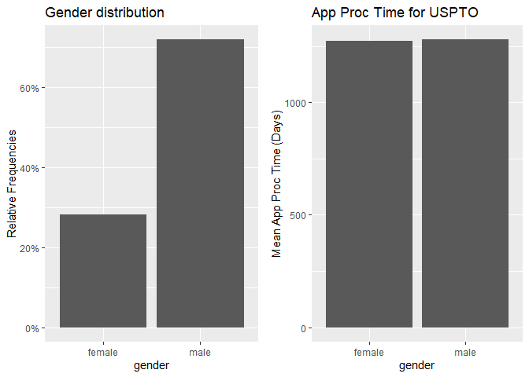

Exercise 4
================

## Load libraries

``` r
library(tidyverse)
```

    ## ── Attaching packages ─────────────────────────────────────── tidyverse 1.3.1 ──

    ## ✔ ggplot2 3.3.5     ✔ purrr   0.3.4
    ## ✔ tibble  3.1.6     ✔ dplyr   1.0.9
    ## ✔ tidyr   1.2.0     ✔ stringr 1.4.0
    ## ✔ readr   2.1.2     ✔ forcats 0.5.1

    ## ── Conflicts ────────────────────────────────────────── tidyverse_conflicts() ──
    ## ✖ dplyr::filter() masks stats::filter()
    ## ✖ dplyr::lag()    masks stats::lag()

``` r
library(igraph)
```

    ## 
    ## Attaching package: 'igraph'

    ## The following objects are masked from 'package:dplyr':
    ## 
    ##     as_data_frame, groups, union

    ## The following objects are masked from 'package:purrr':
    ## 
    ##     compose, simplify

    ## The following object is masked from 'package:tidyr':
    ## 
    ##     crossing

    ## The following object is masked from 'package:tibble':
    ## 
    ##     as_data_frame

    ## The following objects are masked from 'package:stats':
    ## 
    ##     decompose, spectrum

    ## The following object is masked from 'package:base':
    ## 
    ##     union

``` r
library(tidygraph)
```

    ## 
    ## Attaching package: 'tidygraph'

    ## The following object is masked from 'package:igraph':
    ## 
    ##     groups

    ## The following object is masked from 'package:stats':
    ## 
    ##     filter

``` r
library(ggraph)
library(readr)
library(lubridate)
```

    ## 
    ## Attaching package: 'lubridate'

    ## The following objects are masked from 'package:igraph':
    ## 
    ##     %--%, union

    ## The following objects are masked from 'package:base':
    ## 
    ##     date, intersect, setdiff, union

``` r
library(arrow)
```

    ## 
    ## Attaching package: 'arrow'

    ## The following object is masked from 'package:lubridate':
    ## 
    ##     duration

    ## The following object is masked from 'package:utils':
    ## 
    ##     timestamp

``` r
library(gender)
library(wru)
library(ggplot2)
library(gridExtra)
```

    ## 
    ## Attaching package: 'gridExtra'

    ## The following object is masked from 'package:dplyr':
    ## 
    ##     combine

``` r
library(grid)
```

## Load data

``` r
applications <- read_parquet("app_data_sample.parquet")
edges <- read_csv("edges_sample.csv")
```

    ## Rows: 32906 Columns: 4
    ## ── Column specification ────────────────────────────────────────────────────────
    ## Delimiter: ","
    ## dbl  (3): application_number, ego_examiner_id, alter_examiner_id
    ## date (1): advice_date
    ## 
    ## ℹ Use `spec()` to retrieve the full column specification for this data.
    ## ℹ Specify the column types or set `show_col_types = FALSE` to quiet this message.

## Add attributes

### gender

``` r
examiner_names <- applications %>% 
  distinct(examiner_name_first)
# get a table of names and gender
examiner_names_gender <- examiner_names %>% 
  do(results = gender(.$examiner_name_first, method = "ssa")) %>% 
  unnest(cols = c(results), keep_empty = TRUE) %>% 
  select(
    examiner_name_first = name,
    gender,
    proportion_female
  )
examiner_names_gender
```

    ## # A tibble: 1,822 × 3
    ##    examiner_name_first gender proportion_female
    ##    <chr>               <chr>              <dbl>
    ##  1 AARON               male              0.0082
    ##  2 ABDEL               male              0     
    ##  3 ABDOU               male              0     
    ##  4 ABDUL               male              0     
    ##  5 ABDULHAKIM          male              0     
    ##  6 ABDULLAH            male              0     
    ##  7 ABDULLAHI           male              0     
    ##  8 ABIGAIL             female            0.998 
    ##  9 ABIMBOLA            female            0.944 
    ## 10 ABRAHAM             male              0.0031
    ## # … with 1,812 more rows

``` r
# remove extra colums from the gender table
examiner_names_gender <- examiner_names_gender %>% 
  select(examiner_name_first, gender)
# joining gender back to the dataset
applications <- applications %>% 
  left_join(examiner_names_gender, by = "examiner_name_first")
# cleaning up
rm(examiner_names)
rm(examiner_names_gender)
gc()
```

    ##            used  (Mb) gc trigger  (Mb) max used  (Mb)
    ## Ncells  4787964 255.8    8218951 439.0  4807969 256.8
    ## Vcells 50014685 381.6   93606503 714.2 80330465 612.9

### add race

``` r
examiner_surnames <- applications %>% 
  select(surname = examiner_name_last) %>% 
  distinct()
examiner_race <- predict_race(voter.file = examiner_surnames, surname.only = T) %>% 
  as_tibble()
```

    ## [1] "Proceeding with surname-only predictions..."

    ## Warning in merge_surnames(voter.file): Probabilities were imputed for 698
    ## surnames that could not be matched to Census list.

``` r
examiner_race <- examiner_race %>% 
  mutate(max_race_p = pmax(pred.asi, pred.bla, pred.his, pred.oth, pred.whi)) %>% 
  mutate(race = case_when(
    max_race_p == pred.asi ~ "Asian",
    max_race_p == pred.bla ~ "black",
    max_race_p == pred.his ~ "Hispanic",
    max_race_p == pred.oth ~ "other",
    max_race_p == pred.whi ~ "white",
    TRUE ~ NA_character_
  ))
examiner_race <- examiner_race %>% 
  select(surname,race)
applications <- applications %>% 
  left_join(examiner_race, by = c("examiner_name_last" = "surname"))
rm(examiner_race)
rm(examiner_surnames)
gc()
```

    ##            used  (Mb) gc trigger  (Mb) max used  (Mb)
    ## Ncells  5127681 273.9    8218951 439.0  5767422 308.1
    ## Vcells 53700689 409.8   93606503 714.2 92470705 705.5

### Add tenure

``` r
examiner_dates <- applications %>% 
  select(examiner_id, filing_date, appl_status_date) 
examiner_dates <- examiner_dates %>% 
  mutate(start_date = ymd(filing_date), end_date = as_date(dmy_hms(appl_status_date)))

examiner_dates <- examiner_dates %>% 
  group_by(examiner_id) %>% 
  summarise(
    earliest_date = min(start_date, na.rm = TRUE), 
    latest_date = max(end_date, na.rm = TRUE),
    tenure_days = interval(earliest_date, latest_date) %/% days(1)
    ) %>% 
  filter(year(latest_date)<2018)

applications <- applications %>% 
  left_join(examiner_dates, by = "examiner_id")
rm(examiner_dates)
gc()
```

    ##            used  (Mb) gc trigger   (Mb)  max used   (Mb)
    ## Ncells  5142169 274.7   14572380  778.3  14572380  778.3
    ## Vcells 66080291 504.2  134969363 1029.8 134657951 1027.4

## 1. Create variable for application processing time

``` r
application_dates <- applications %>% 
    mutate(decision_date = coalesce(abandon_date,patent_issue_date)) %>%
    select(application_number,filing_date, abandon_date, patent_issue_date, decision_date, examiner_id, examiner_art_unit, gender, race, tenure_days) %>%
    filter(!is.na(decision_date))

application_dates <- application_dates %>% 
    mutate(app_proc_time = difftime(decision_date, filing_date, units = "days"))

application_dates <- application_dates %>% 
    filter(app_proc_time>ddays(0)) %>% 
    filter(app_proc_time<ddays(10000))
```

## 2-Estimate relationship between centrality and application processing time

``` r
# get the workgroup from art unit
application_dates <- application_dates %>%
  mutate(wg = (application_dates$examiner_art_unit%/%10) * 10)
library(plyr)
```

    ## ------------------------------------------------------------------------------

    ## You have loaded plyr after dplyr - this is likely to cause problems.
    ## If you need functions from both plyr and dplyr, please load plyr first, then dplyr:
    ## library(plyr); library(dplyr)

    ## ------------------------------------------------------------------------------

    ## 
    ## Attaching package: 'plyr'

    ## The following objects are masked from 'package:tidygraph':
    ## 
    ##     arrange, mutate, rename

    ## The following objects are masked from 'package:dplyr':
    ## 
    ##     arrange, count, desc, failwith, id, mutate, rename, summarise,
    ##     summarize

    ## The following object is masked from 'package:purrr':
    ## 
    ##     compact

``` r
library(dplyr)
library(lubridate)
application_dates <- mutate(
  application_dates,
  period = case_when(
    filing_date<ymd("2007-01-01") ~ NA_character_,
    filing_date<ymd("2008-01-01") ~ "t0",
    filing_date<ymd("2009-01-01") ~ "t1",
    filing_date<ymd("2010-01-01") ~ "t2",
    filing_date<ymd("2011-01-01") ~ "t3",
    filing_date<ymd("2012-01-01") ~ "t4",
    filing_date<ymd("2013-01-01") ~ "t5",
    filing_date<ymd("2014-01-01") ~ "t6",
    filing_date<ymd("2015-01-01") ~ "t7",
    filing_date<ymd("2016-01-01") ~ "t8",
    TRUE~ NA_character_)
  )

# get number of applications
library(plyr)
examiner_wg_napp <- ddply(application_dates, .(examiner_id, period, wg), nrow)
names(examiner_wg_napp) <- c("examiner_id","period", "wg", "n_applications")

# assume examiner belong to wg most frequently handled applications for
examiner_wg_napp <- examiner_wg_napp[order(examiner_wg_napp$examiner_id, examiner_wg_napp$period, -(examiner_wg_napp$n_applications), -(examiner_wg_napp$wg)), ] ### sort first
examiner_wg <- examiner_wg_napp [!duplicated(examiner_wg_napp[c(1,2)]),]
examiner_wg <- select(examiner_wg, c("examiner_id","wg","period"))
examiner_wg <- drop_na(examiner_wg)

rm(examiner_wg_napp)

# compute average application processing time
cols <- c("examiner_id","period", "wg", "gender", "race", "tenure_days")

examiners <- application_dates %>%
    group_by(across(all_of(cols))) %>%
    dplyr::summarize(mean_app_proc_time = mean(app_proc_time, na.rm=TRUE), n_app = n()) %>%
    drop_na()
```

    ## `summarise()` has grouped output by 'examiner_id', 'period', 'wg', 'gender',
    ## 'race'. You can override using the `.groups` argument.

``` r
# subset work groups
examiner_aus <- examiners %>%
    filter(period == "t1") %>% 
    #filter(wg == 164 | wg == 173) %>%
    select(wg, examiner_id, gender, race, tenure_days, mean_app_proc_time, n_app) %>%
    distinct(examiner_id, .keep_all=TRUE) %>% 
    drop_na() 
```

    ## Adding missing grouping variables: `period`

``` r
# subset from edges
edges_aus <- edges %>%
  filter(ego_examiner_id %in% examiner_aus$examiner_id) %>%
  filter(alter_examiner_id %in% examiner_aus$examiner_id) %>%
  drop_na()

# merge work group information
network <- left_join(edges_aus, examiner_aus, by = c("ego_examiner_id" = "examiner_id"))
colnames(network)[6] <- "ego_examiner_wg"
colnames(network)[7] <- "ego_examiner_gender"
colnames(network)[8] <- "ego_examiner_race"
colnames(network)[9] <- "ego_examiner_tenure"
colnames(network)[10] <- "ego_examiner_appprooctime"
colnames(network)[11] <- "ego_examiner_napp"
network <- subset(network, select = -c(period))
network <- left_join(network, examiner_aus, by = c("alter_examiner_id" = "examiner_id"))
colnames(network)[12] <- "alter_examiner_wg"
colnames(network)[13] <- "alter_examiner_gender"
colnames(network)[14] <- "alter_examiner_race"
colnames(network)[15] <- "alter_examiner_tenure"
colnames(network)[16] <- "alter_examiner_appprooctime"
colnames(network)[17] <- "alter_examiner_napp"
network <- subset(network, select = -c(period))
```

### create network

``` r
# create edge list and node list
edge_list <- select(network, c("ego_examiner_id","alter_examiner_id"))

ego <- select(network, c("ego_examiner_id","ego_examiner_wg")) %>%
    dplyr::rename(id=ego_examiner_id, wg=ego_examiner_wg)
alter <- select(network, c("alter_examiner_id","alter_examiner_wg")) %>%
    dplyr::rename(id=alter_examiner_id, wg=alter_examiner_wg)
nodes <- rbind(ego, alter) %>%
  select(id) %>%
  distinct() %>%
  drop_na()

advice_net = graph_from_data_frame(d=edge_list, vertices=nodes, directed=TRUE)
advice_net
```

    ## IGRAPH 9b5a4e5 DN-- 1519 20803 -- 
    ## + attr: name (v/c)
    ## + edges from 9b5a4e5 (vertex names):
    ##  [1] 84356->63519 92953->91818 92953->91818 72253->61519 72253->72253
    ##  [6] 67078->75772 67078->75772 67078->97328 91688->71059 91688->71059
    ## [11] 91688->67669 91688->67669 61797->78036 94270->81337 94270->81337
    ## [16] 94270->66927 94270->66927 94270->66927 94270->66927 73223->92537
    ## [21] 73223->92537 94270->97655 94270->97655 94270->81337 94270->66927
    ## [26] 94270->66927 60128->69459 75772->99395 75772->99395 75772->99395
    ## [31] 75772->99395 75772->99395 75772->99395 75772->99395 75772->99395
    ## [36] 75772->77746 75772->77746 75772->77746 75772->77746 67713->77746
    ## + ... omitted several edges

### get centrality measures

``` r
# calculate Centrality 
V(advice_net)$dc <- degree(advice_net)
V(advice_net)$bc <- betweenness(advice_net)
V(advice_net)$ec <- evcent(advice_net)$vector
V(advice_net)$cc <- closeness(advice_net)

centrality <- data.frame(cbind(nodes$id, V(advice_net)$dc, V(advice_net)$bc, V(advice_net)$ec, V(advice_net)$cc)) 
colnames(centrality)[1] <- "examiner_id"
colnames(centrality)[2] <- "degree_centrality"
colnames(centrality)[3] <- "betweenness_centrality"
colnames(centrality)[4] <- "eigenvector_centrality"
colnames(centrality)[5] <- "closeness_centrality"

examiner_joined <- left_join(examiner_aus, centrality, by = c("examiner_id" = "examiner_id"))
examiner_joined <- examiner_joined %>%
  drop_na(degree_centrality)

head(examiner_joined)
```

    ## # A tibble: 6 × 12
    ## # Groups:   examiner_id, period, wg, gender, race [6]
    ##   period    wg examiner_id gender race  tenure_days mean_app_proc_time n_app
    ##   <chr>  <dbl>       <dbl> <chr>  <chr>       <dbl> <drtn>             <int>
    ## 1 t1      2120       59056 male   Asian        6268 1513.1000 days        10
    ## 2 t1      2180       59056 male   Asian        6268  879.1481 days        54
    ## 3 t1      2160       59141 female Asian        4582 1839.5556 days        18
    ## 4 t1      2160       59181 female black        6331 1324.6038 days        53
    ## 5 t1      1640       59211 male   white        6332 1044.1250 days        56
    ## 6 t1      1730       59227 female white        6349 1270.4176 days        91
    ## # … with 4 more variables: degree_centrality <dbl>,
    ## #   betweenness_centrality <dbl>, eigenvector_centrality <dbl>,
    ## #   closeness_centrality <dbl>

``` r
rm(examiner_wg)
rm(alter)
rm(ego)
rm(examiner_aus)
rm(edges_aus)
rm(edge_list)
rm(edges)
rm(nodes)
rm(centrality)
```

``` r
graphnetwork <- ggraph(advice_net, layout = "kk") +                                         
  geom_node_point(size = 2,  ) +  
  geom_node_text(aes(label = ""), nudge_y = 0.05, nudge_x = 0.2)+ 
  geom_edge_link(edge_color="grey")
graphnetwork
```

<!-- -->

``` r
# estimate the relation between centrality and app_proc_time
mreg = lm(as.numeric(mean_app_proc_time)~degree_centrality+betweenness_centrality+eigenvector_centrality+closeness_centrality,
          data=examiner_joined)
summary(mreg)
```

    ## 
    ## Call:
    ## lm(formula = as.numeric(mean_app_proc_time) ~ degree_centrality + 
    ##     betweenness_centrality + eigenvector_centrality + closeness_centrality, 
    ##     data = examiner_joined)
    ## 
    ## Residuals:
    ##      Min       1Q   Median       3Q      Max 
    ## -1088.24  -354.91    21.97   304.69  1873.88 
    ## 
    ## Coefficients:
    ##                          Estimate Std. Error t value Pr(>|t|)    
    ## (Intercept)             1.357e+03  2.298e+01  59.058  < 2e-16 ***
    ## degree_centrality      -9.361e-01  2.681e-01  -3.492 0.000495 ***
    ## betweenness_centrality -6.844e-03  1.189e-02  -0.576 0.564833    
    ## eigenvector_centrality  5.455e+01  3.839e+02   0.142 0.887022    
    ## closeness_centrality   -4.913e+01  3.806e+01  -1.291 0.196954    
    ## ---
    ## Signif. codes:  0 '***' 0.001 '**' 0.01 '*' 0.05 '.' 0.1 ' ' 1
    ## 
    ## Residual standard error: 509.1 on 1350 degrees of freedom
    ##   (843 observations deleted due to missingness)
    ## Multiple R-squared:  0.01142,    Adjusted R-squared:  0.008492 
    ## F-statistic: 3.899 on 4 and 1350 DF,  p-value: 0.003739

#### We observe that Degree centrality, betweenness centrality and closeness centrality reduce the length of processing applications.

\####Degree centrality: when adding 1 degree centrality, we reduce
processing time by 0.9361 days. This implies that the more degree
centrality the faster the application. An examiner who has a great
amount of connections is more efficient in this network than an examiner
with less connections. \#### Betweenness centrality and closeness
centrality also have an inversely related application time. In
particular with closeness centrality the impact is to reduce application
times by 49 days (this seems a big number). It implies that being on the
shortest paths between examiners, allows to reduce processing times
significantly. \#### On the other hand, an increase in Eigen vector
centrality decreases the efficiency of applications: knowing “famous”
friends does not help reduce application times. On the contrary we may
infer that famous friends would themselves be too busy being efficient
with processing their own applications received, to the detriment of
helping high eigen-vector friends.

``` r
#### linear regression - selected work groups
examiner_joined_2wg <- examiner_joined %>%
filter(wg == 1640 | wg == 1730)

mreg2 = lm(as.numeric(mean_app_proc_time)~degree_centrality+betweenness_centrality+eigenvector_centrality+closeness_centrality,
          data=examiner_joined_2wg)
summary(mreg2)
```

    ## 
    ## Call:
    ## lm(formula = as.numeric(mean_app_proc_time) ~ degree_centrality + 
    ##     betweenness_centrality + eigenvector_centrality + closeness_centrality, 
    ##     data = examiner_joined_2wg)
    ## 
    ## Residuals:
    ##     Min      1Q  Median      3Q     Max 
    ## -654.70 -166.75    1.35  151.06  597.64 
    ## 
    ## Coefficients:
    ##                          Estimate Std. Error t value Pr(>|t|)    
    ## (Intercept)             1.318e+03  4.803e+01  27.433   <2e-16 ***
    ## degree_centrality       1.010e-01  4.287e-01   0.236    0.814    
    ## betweenness_centrality  1.336e-01  2.482e-01   0.538    0.592    
    ## eigenvector_centrality  5.946e+07  8.732e+07   0.681    0.498    
    ## closeness_centrality   -4.077e+01  7.174e+01  -0.568    0.571    
    ## ---
    ## Signif. codes:  0 '***' 0.001 '**' 0.01 '*' 0.05 '.' 0.1 ' ' 1
    ## 
    ## Residual standard error: 242.5 on 82 degrees of freedom
    ##   (48 observations deleted due to missingness)
    ## Multiple R-squared:  0.01485,    Adjusted R-squared:  -0.03321 
    ## F-statistic: 0.309 on 4 and 82 DF,  p-value: 0.8712

#### The relationships observed between centrality and efficiency is different in our selected subgroup than on the overall network. In our subset, higher centrality measures involve higher processing times, except only in the case of closeness centrality. Interestingly in this subset, an increase in degree centrality, betweenness centrality and eigen vector centrality, drive higher processing times. In this case, what matters is not “what you know” nor “who you know”.

#### Closeness centrality in this case is the only centrality measure which inversely correlated with efficiency. Being on the shortest path between examiners is, comparativley to other measures, more an asset in this subset than it is for the overall network. The type of applications in this subset seems to differ from the entire network.

## 3 - Impact of gender

``` r
library(scales) 
```

    ## 
    ## Attaching package: 'scales'

    ## The following object is masked from 'package:purrr':
    ## 
    ##     discard

    ## The following object is masked from 'package:readr':
    ## 
    ##     col_factor

``` r
plot1 <- ggplot(examiner_joined, aes(gender)) + 
          geom_bar(aes(y = (..count..)/sum(..count..))) + 
          scale_y_continuous(labels=scales::percent) +
          ylab("Relative Frequencies") +
          ggtitle("Gender distribution")

plot1
```

<!-- --> \####
network is composed of vast majority of males, around 72%

``` r
# male
examiner_joined_m <- examiner_joined %>%
  filter(gender == "male")

mreg3 = lm(as.numeric(mean_app_proc_time)~degree_centrality+betweenness_centrality+eigenvector_centrality+closeness_centrality,
           data=examiner_joined_m)
summary(mreg3)
```

    ## 
    ## Call:
    ## lm(formula = as.numeric(mean_app_proc_time) ~ degree_centrality + 
    ##     betweenness_centrality + eigenvector_centrality + closeness_centrality, 
    ##     data = examiner_joined_m)
    ## 
    ## Residuals:
    ##      Min       1Q   Median       3Q      Max 
    ## -1109.05  -346.62    26.79   304.06  1788.31 
    ## 
    ## Coefficients:
    ##                          Estimate Std. Error t value Pr(>|t|)    
    ## (Intercept)             1.387e+03  2.684e+01  51.658  < 2e-16 ***
    ## degree_centrality      -1.150e+00  3.214e-01  -3.577 0.000365 ***
    ## betweenness_centrality  1.610e-04  1.342e-02   0.012 0.990432    
    ## eigenvector_centrality  1.997e+02  3.997e+02   0.500 0.617345    
    ## closeness_centrality   -8.984e+01  4.481e+01  -2.005 0.045255 *  
    ## ---
    ## Signif. codes:  0 '***' 0.001 '**' 0.01 '*' 0.05 '.' 0.1 ' ' 1
    ## 
    ## Residual standard error: 513.2 on 969 degrees of freedom
    ##   (605 observations deleted due to missingness)
    ## Multiple R-squared:  0.01605,    Adjusted R-squared:  0.01199 
    ## F-statistic: 3.951 on 4 and 969 DF,  p-value: 0.003461

#### the most efficient centrality measure in this case are degree and closeness centrality: the more connections the male examiner has, and the more frequently he is on shortest paths between other examiners, the more efficient he is in processing applications. NOthe that this reflects in part what we observed in the overall network, un pacticular the highest reduction in processing times with closeness centrality. On the other hand, having “famous” friends does not help to be efficient, on the contrary.

``` r
# female
examiner_joined_f <- examiner_joined %>%
  filter(gender == "female")

mreg4 = lm(as.numeric(mean_app_proc_time)~degree_centrality+betweenness_centrality+eigenvector_centrality+closeness_centrality,
           data=examiner_joined_f)
summary(mreg4)
```

    ## 
    ## Call:
    ## lm(formula = as.numeric(mean_app_proc_time) ~ degree_centrality + 
    ##     betweenness_centrality + eigenvector_centrality + closeness_centrality, 
    ##     data = examiner_joined_f)
    ## 
    ## Residuals:
    ##      Min       1Q   Median       3Q      Max 
    ## -1008.43  -361.46    30.34   307.99  1876.62 
    ## 
    ## Coefficients:
    ##                          Estimate Std. Error t value Pr(>|t|)    
    ## (Intercept)             1.277e+03  4.462e+01  28.612   <2e-16 ***
    ## degree_centrality      -3.689e-01  4.849e-01  -0.761    0.447    
    ## betweenness_centrality -3.491e-02  2.606e-02  -1.340    0.181    
    ## eigenvector_centrality -3.238e+03  3.152e+03  -1.027    0.305    
    ## closeness_centrality    6.634e+01  7.223e+01   0.918    0.359    
    ## ---
    ## Signif. codes:  0 '***' 0.001 '**' 0.01 '*' 0.05 '.' 0.1 ' ' 1
    ## 
    ## Residual standard error: 496.4 on 376 degrees of freedom
    ##   (238 observations deleted due to missingness)
    ## Multiple R-squared:  0.01609,    Adjusted R-squared:  0.005622 
    ## F-statistic: 1.537 on 4 and 376 DF,  p-value: 0.1907

#### The relationship between different centrality measures and efficiency is different between males and females in our network. The female group within the network shows different effects of centrality measures on efficiency in processing applications. While the male subgroup and the overall group have higher efficiency with higher closeness, in this case closeness centrality is driving longer processing times. On the other hand, to reduce processing times the most efficiently is having “famous” friends in this subgroup. This contrasts greatly with all the case obeserved so far.

#### So for a female examiner to be more efficient, she needs to know someone “famous” or “powerful”. We may infer this would be male examiners… So whetever the nuymber of connections or the situation on the paths of other examiners, what makes a female more efficient is to know someone influent.

## 4. Implications

``` r
#Visualizing the gender distribution and application processing time by gender for USPTO.

plot2 <- ggplot(examiner_joined, aes(gender,mean_app_proc_time)) + 
          geom_bar(posititon="dodge", stat="summary", fun="mean") + 
          ylab("Mean App Proc Time (Days)") +
          #ylim(0,0.65) +
          ggtitle("App Proc Time for USPTO")
```

    ## Warning: Ignoring unknown parameters: posititon

``` r
grid.arrange(plot1,plot2,ncol=2, widths=c(1,1))
```

    ## Don't know how to automatically pick scale for object of type difftime. Defaulting to continuous.

<!-- -->

#### The overall efficiency of females in this network is lower than this of males. As females depend more on famous friends to become efficient than males, and as there are mostly males, we can imagine a situation where women need to ask for help to become efficient. Meanwhile males are more efficient when having higher closeness centrality.

``` r
#Visualizing the gender distribution and application processing time by gender for subgroup.
library(scales) 
plot3 <- ggplot(examiner_joined_2wg, aes(gender)) + 
          geom_bar(aes(y = (..count..)/sum(..count..))) + 
          scale_y_continuous(labels=scales::percent) +
          ylab("Relative Frequencies") +
          ggtitle("Gender distribution")

plot4 <- ggplot(examiner_joined_2wg, aes(gender,mean_app_proc_time)) + 
          geom_bar(posititon="dodge", stat="summary", fun="mean") + 
          ylab("Mean App Proc Time (Days)") +
          #ylim(0,0.65) +
          ggtitle("App Proc Time for USPTO")
```

    ## Warning: Ignoring unknown parameters: posititon

``` r
grid.arrange(plot3,plot2,ncol=2, widths=c(1,1))
```

    ## Don't know how to automatically pick scale for object of type difftime. Defaulting to continuous.

<!-- -->

#### Subset is composed of majority of males, but the gap is smaller in this subset than it is in the general population of the network (males at close to 60%). We can infer that women in this subest have more cooperation between one another, than they have in general population, because they are proportionnaly better represented and can help each other more. This would explain the better relative efficiency of women than this of men in this subset.

#### as a conclusion, having amore balanced ratio of male and female allows for better efficiency of women. However fromp the chart the efficiency of men seems to decrease in this subest as compared to the overall network. So the USPTO would need to find the right balance bewteen genders to have the highest overall efficiency.

#### Of course all these comments cover only gender, it could be interesting to look at other variables to further understand how working groups could be composed to reach optimal efficiency within the overall network.
